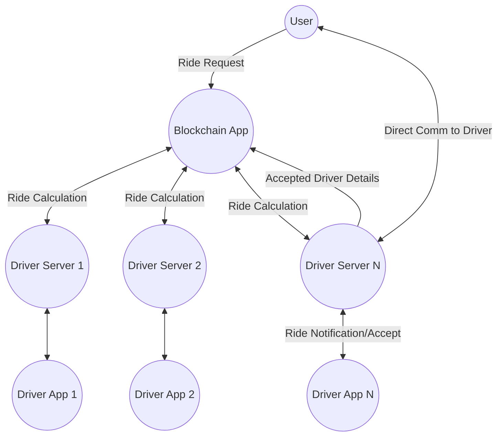
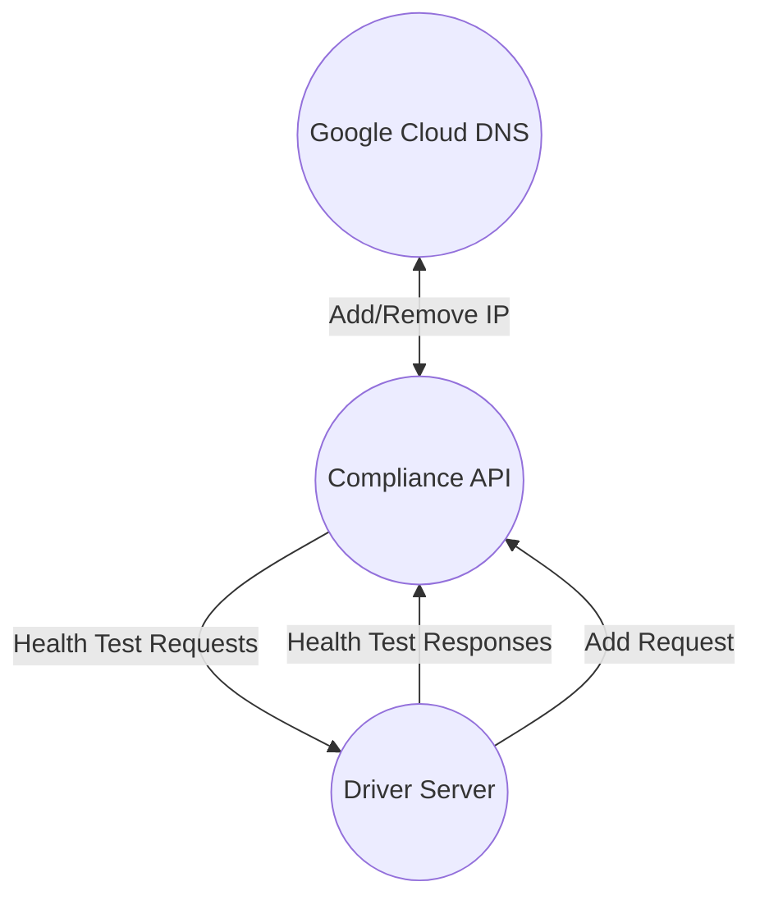
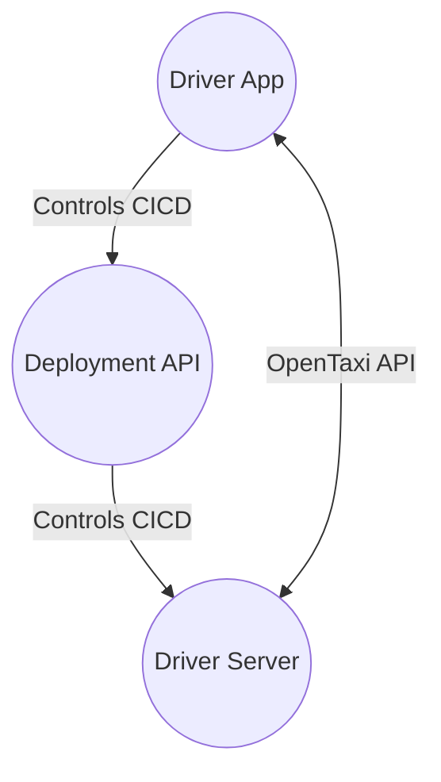

# OpenTaxi Standards and Protocols

## Table of Contents

1. [OpenTaxi Overview](#opentaxi-overview)
2. [Routing and DNS](#routing-and-dns)
3. [User Application](#user-application)
4. [Driver Server](#driver-server)
5. [Decentralized Application](#decentralized-application)
6. [Driver Application](#driver-application)
7. [Legal Requirements](#legal-requirements)
8. [Business Requirements](#business-requirements)

---

## 1. OpenTaxi Overview  

- Users initiate ride requests through the OpenTaxi mobile application.
- The user's ride request is sent to the OpenTaxi decentralized application via the blockchain network.
- The Driver servers will read the passengers details and calculate feasibility scores based on drivers current status.
- Drivers with a higher scores will post to the blockchain, over taking previous drivers.
- Highest scoring drivers will be given the option to accept a ride.  Once accepted, the driver posts their server url and other details to the blockchain.
- Users retrieve the driver's server url from the blockchain and begin direct communication.
- Payment is then handled through traditional server/client payment processors
---

## 2. Routing And DNS

### Purpose
In order to facilitate passenger and blockchain communication, a centralized DNS will be required to route
passengers to a blockchain node that every driver will have on their server.

### Compliance API
The compliance API will be a cloud run server that takes in a request from a driver server that wishes to be 
added to the OpenTaxi DNS.  The Compliance API will then run through a list of test requests to the drivers
API to ensure that everything is in compliance with the OpenTaxi standard.  Once the test has passed, the driver server's
Domain URL will be added.

### Compliance Tests TBD
TODO, add the list of required tests

## 3. User Application
### User Authentication and Onboarding
- Integration with Google OAuth for user authentication
- User registration via Google account
- Google OAUTH User Account IDs to track users across the decentralized driver servers 

### Requesting Rides
- Users will post a message onto the blockchain with their location, destination and User Account ID
- When a ride is accepted by a driver, their server url will be posted onto the blockchain

### Starting Ride
- Once users have connected to the drivers server the application behaves like a normal server/client application
- Users provide payment details through a third party payment processor (ie Stripe)

### Ending Ride
- The driver's server will use the third party payment processor to charge the customer 
- The driver server will email the customer a receipt that contains the ride information and also a link for disputes/issues

---

## 4. Driver Server

### Purpose
The driver server is a stand-alone server that is built specifically for each driver. The server will handle payment process
and customer and driver interactions.  Drivers will pay for server costs and all third party fees.  The driver server will also
continuously process blockchain results to look for potential rides.

### Automated Infrastructure Deployment
- On a driver's initial sign up, a light deployment server will be deployed to the cloud provider from the drivers mobile app
  - Having the deployment API is a way to avoid having to deploy complicated infrastructure via a mobile app
  - This step will also take care of all cloud setup requirements (Billing, Auth, Payment Processing, credentials etc)
- Once the initial Deployment API is up, the main Driver Server infrastructure can be deployed

### Ride Discovery
- Drivers will make an API request to their server to signal they are looking for rides
- A serverless process will kick off that continuously reads the blockchain looking for rides 
- Upon discovery, the process will retrieve the current drivers location and current ride status to calculate a feasibility score  
  - TBD on "feasibility" algorithm
- If a driver scores high enough on a feasibility score the process will send a push notification to the driver's app.

### Ride Acceptance
- Drivers who accept a ride will then post a response to their servers API.  The server will then post their details to the blockchain for the customer to find.
- Customers retrieve the server url from the blockchain and then start communicating directly with the drivers API
- A third party payment processor will then process the customers payment details and verify that they can pay
- Driver location and details will then be shared to the user
- At this stage everything will behave like a traditional app

### Ending Ride
- Driver makes an end ride request to server
- Server calculates charges and charges customer
- Server generates an email containing receipt and dispute link

---

## 5. Decentralized Application 
### Purpose
To facilitate connecting customers and drivers without needing a centralized server.

### Requesting Ride
- Customers will post their Google User Account ID and start/end location
- Driver servers will calculate feasibility of a ride

### Confirming a Ride
- A driver with a high feasibility score will be given an option to accept or deny a ride
- Accepting a ride then posts a confirmation.  This conformation contains the drivers server url that allows customer/driver direct communication.

---

## 6. Driver Application
### Purpose
A mobile application that handles setting up servers, legal requirement walk through, business formation requirements.  
The application serves as a helper to streamline the process of founding a sole proprietor taxi company that behaves like a ride-share app.

### Starting/Ending A Shift
- Drivers will make a request to their server that they are currently looking for customers
- This starts a process that continuously searches the blockchain for potential rides
- When drivers want to quit, they make a request to their server to stop searching

### Accepting a Ride
- Rides that are a match for the driver will trigger a push notification to the drivers phone
- Accepting the ride will be done by making a post request to the driver's server
- An internal link inside the app will be used to open a navigation app of the drivers choice
  - Built in navigation will not be performed

### Finishing a ride
- Drivers will confirm their ride is complete by sending a request to their server
- The request will then charge the customer through the third party payment processor

---

## 7. Legal Requirements
TBD. This will be fairly complex and will have to slowly roll out to locations that have friendly laws.  Documents will need to be captured and uploaded to the driver's server.

---

## 8. Business Requirements
Just like the legal requirements, location specific guidance will be needed for setting up a business entity and the required insurance. Documents will need to be captured and uploaded to the driver's server.
